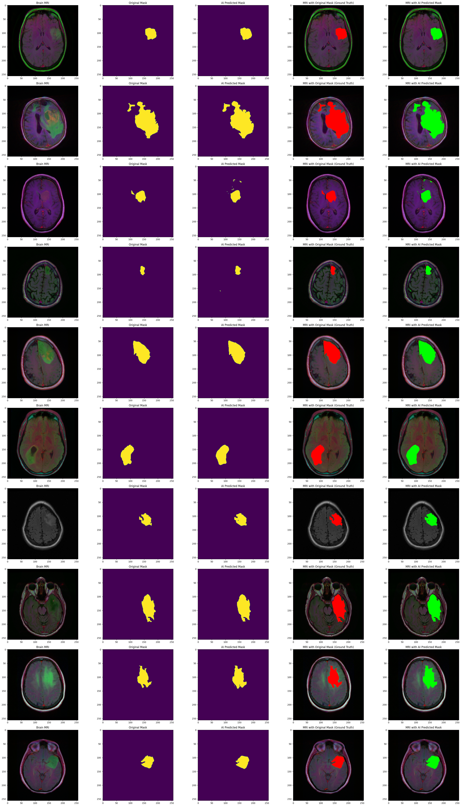

# 🧠 Healthcare AI – Brain Tumor Segmentation Using ResUNet

This project performs **pixel-level segmentation** on brain MRI scans to detect and localize tumors using deep learning. A custom **ResUNet architecture** is implemented to generate segmentation masks that highlight tumor regions with high accuracy. The model is trained and evaluated on paired MRI images and corresponding masks, using metrics like the Dice coefficient.

---

## 🔍 Project Overview

- **Goal**: Detect and highlight tumor regions in brain MRI scans.  
- **Approach**: Image segmentation using ResUNet architecture.  
- **Output**: Segmentation mask overlaid on the MRI image for clear tumor visualization.

---

## 🛠️ Features

- ✅ MRI Preprocessing (flattening, resizing)  
- ✅ Tumor Segmentation using ResUNet  
- ✅ Visualization of segmentation masks  
- ✅ Evaluation using Dice Coefficient  
- ✅ Pre-trained weights included (`weights_seg.hdf5`)

---

## 📁 Project Structure

```
📦 Healthcare_AI_Segmentation/
├── Copy_of_Healthcare_AI(final).ipynb   # Main notebook
├── utilities.py                         # Helper functions (preprocessing, visualization)
├── data.csv                             # Dataset paths/info
├── data_mask.csv                        # Corresponding mask paths
├── healthcareAISampleoutput.png         # Sample segmented output
├── weights_seg.hdf5                     # Trained model weights
├── ResUNet-MRI.json                     # ResUNet architecture
├── resnet-50-MRI.json                   # Optional ResNet encoder variant
```

---

## 🧠 Model Architecture: ResUNet

ResUNet combines the **residual connections** of ResNet with the **encoder-decoder** structure of U-Net to achieve high performance in biomedical image segmentation. Key components:

- Convolutional blocks with skip/residual connections  
- Bottleneck for feature compression  
- Decoder for upsampling and mask generation

---

## 🖼️ Input & Output

- **Input**: Preprocessed brain MRI scan (grayscale image)  
- **Output**: Segmentation mask (binary) showing tumor area

---

## ⚙️ Preprocessing Steps

- Resize all images to a fixed dimension  
- Normalize pixel intensities  
- Convert to NumPy arrays  
- Flatten if required for uniformity

---

## 📈 Evaluation Metric

- **Dice Coefficient**  
  Measures the overlap between the predicted and actual mask:  
  \[
  Dice = \frac{2 \cdot |Prediction \cap GroundTruth|}{|Prediction| + |GroundTruth|}
  \]

---

## ▶️ How to Run

1. Clone the repository or open the notebook in Colab.  
2. Upload all required files (`weights_seg.hdf5`, `.csv` files, and `.json` configs).  
3. Run `Copy_of_Healthcare_AI(final).ipynb` step-by-step.  
4. Modify paths in `data.csv` and `data_mask.csv` if needed.  
5. Visualize results and accuracy.

---

## 🧪 Sample Output

  
The mask is overlaid on the original scan to highlight the tumor.

---

## 📦 Requirements

Install dependencies:

```bash
pip install tensorflow numpy matplotlib opencv-python
```

---

## ✍️ Author

**Sai Sohan Sajja**  
AI Enthusiast | Healthcare Innovator | [LinkedIn](#)
